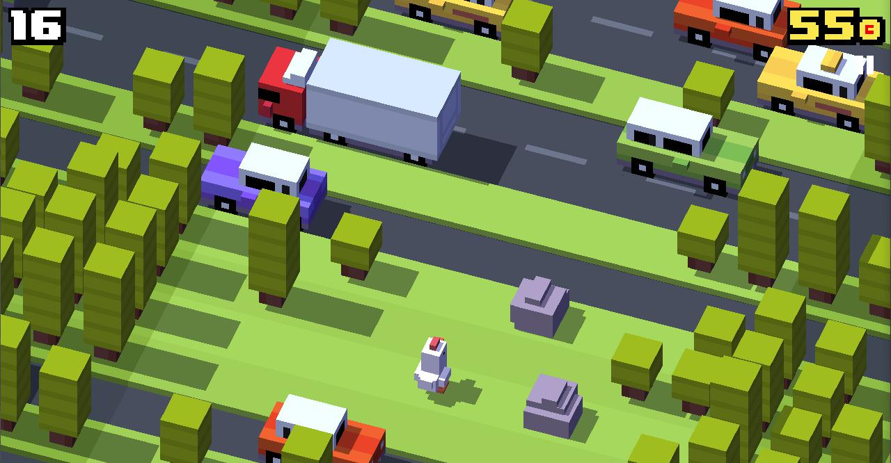
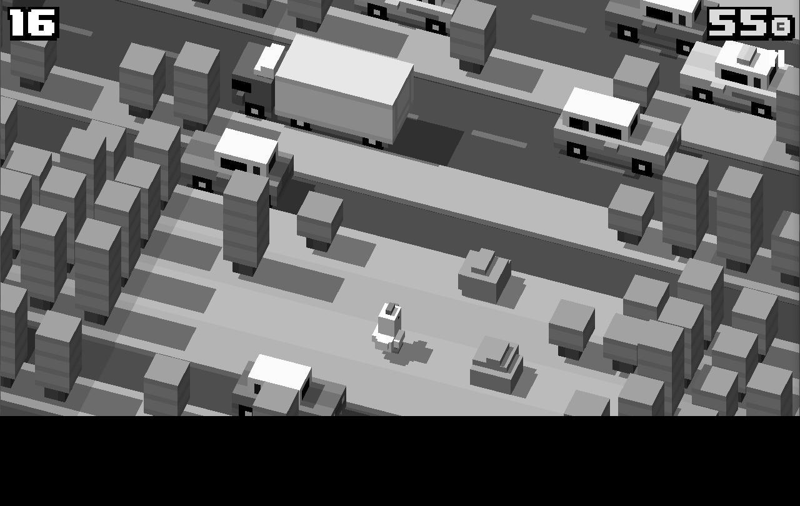
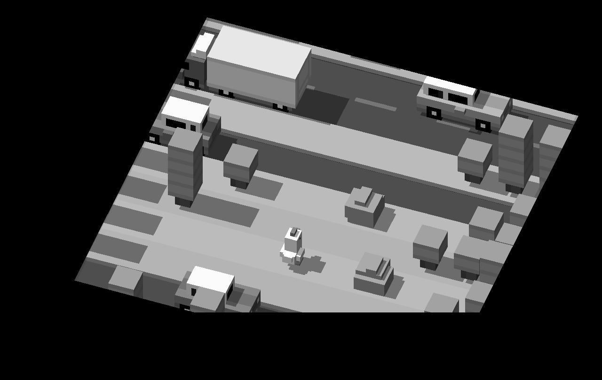
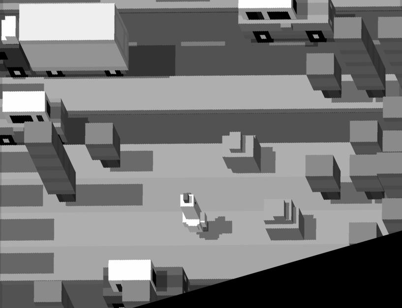
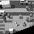
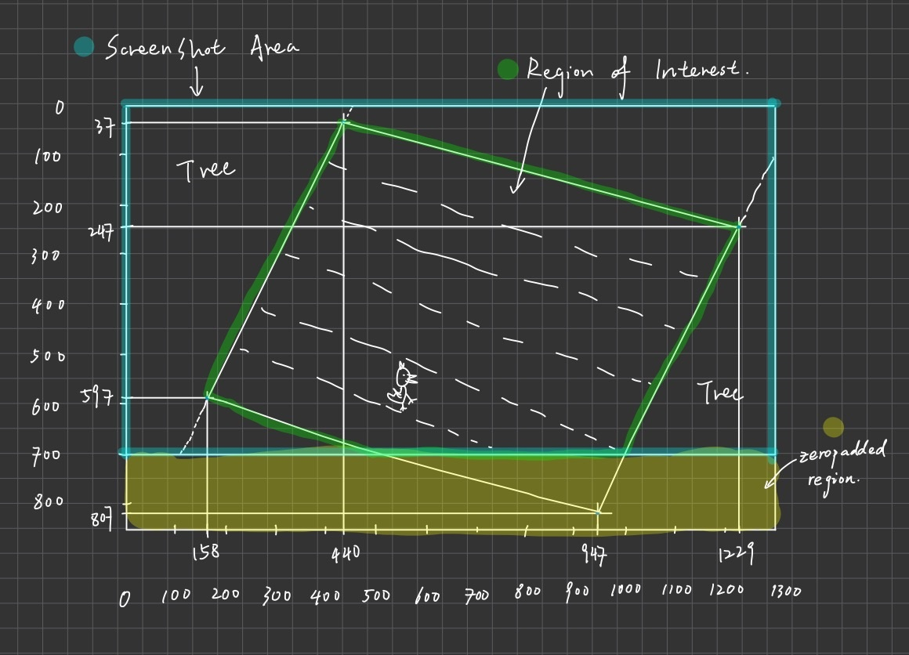

# auto_crossy_road :rooster:

I'm training an AI to play "crossy road" the computer game with CNN. 


(Real self play footage)

Inspired by sentdex's GTA V project (link at the bottom).

## Table of Contents
  * [Getting started](#getting-started)
  * [Collecting data](#collecting-data)
    + [Detailed steps](#detailed-steps)
    + [Dimension and coordinates](#dimension-and-coordinates)
  * [Preparing data](#preparing-data)
    + [Validating data](#validating-data)
    + [Balancing data](#balancing-data)
  * [Training model](#training-model)
    + [Loading data](#loading-data)
    + [Neural net design](#neural-net-design)
  * [Running model](#running-model)
  * [Usage](#usage)
    + [Full training experience](#full-training-experience)
    + [Just trying out the model](#just-trying-out-the-model)
  * [More runtime footage](#more-runtime-footage)
  * [Links](#links)


## Getting started

When playing "crossy road", there are 5 possible actions that can be taken by our main character depending on the situation: 

| Action        | Keyboard action           | Situation
| ------------- | ------------------------- | ---------------------------------------------------------------------------------------
| move forward  | press 'w' on keyboard     | Open lane ahead, no risk of getting hit by car & has a safe landing space
| move left     | press 'a' on keyboard     | Got blocked by obstacle or has a car coming from the right
| move backward | press 's' on keyboard     | Got blcoked by obstacle or has a car coming from the left
| move right    | press 'd' on keyboard     | Neither the current position nor the position is ahead is safe
| stay          | press nothing on keyboard | The current position is safe and the charater is waiting for the car ahead to pass

Therefore, the main idea of this project is to first get a lot of screenshots during gameplay, with information recording about each screenshot's related action, then use that to train a CNN model that output categorical value. And during actually run, just grab the screen as frequent as possible while running the model, outputing the predicting into the game and help our chicken navigate through the map. 

## Collecting data

As the name suggests, the code in 'grab_data' takes care of the part where all the training datas are collected. The code's default running environment should be a working 'crossy road' app running on the top left corner, windowed, at 699 * 1280. The code will grab a snapshot of resolution 666 * 1280 (-33 in x-axis to get rid of the title bar) about 10 times per second and processes it a little bit before saving each coresponding folder related to the action linked to the image, within the '/data' folder under the current working directory. This code also offers a functionality that allows you to clear all saved images under '/data', with all folders indicating motions untouched. 

### Detailed steps

1. The original screenshot taken of the game:
    ```python
    screen =  np.array(ImageGrab.grab(bbox=(0,33,1280,699)))
    ```
  
   

2. Grayscaling the image and zero padding the bottom to prepare for straightening the image:
    ```python
    processed_img = cv2.cvtColor(original_image, cv2.COLOR_BGR2GRAY)
    processed_img = np.pad(processed_img, ((0,144),(0,0)), 'constant')
    ```

   

3. ROI after getting rid of the irrelevant information in the image: 
    ```python
    def roi(img, vertices):
      mask = np.zeros_like(img)
      cv2.fillPoly(mask, vertices, 255)
      masked = cv2.bitwise_and(img, mask)
      return masked

    vertices = np.array([[440,37],[158,597], [425,664], [1001,665], [1229,247]], np.int32)
    processed_img = roi(processed_img, [vertices])
    ```
  
   

4. Straighten the image to get rid of the black space: 
   ```python
    pts_src = np.array([[440,37], [1229,247], [158,597],[947,807]])
    pts_dst = np.array([[0,0],[817, 0],[0,627],[817, 627]])
    im_dst = np.zeros((627, 817, 3), np.uint8)
    h, status = cv2.findHomography(pts_src, pts_dst)
    processed_img = cv2.warpPerspective(processed_img, h, (im_dst.shape[1],im_dst.shape[0]))
    ```
    
    

5. Resize the image to 50 x 50 before being fed into the model
    ```python
    tmp = cv2.resize(new_screen, (50, 50))
    ```
    
    
    

### Dimension and coordinates

* Here is a hand drawn image for coordinate reference:

  

## Preparing data

### Validating data

Since duration of the animation of each move may vary depending on the interval between keys pressed, and the animation time is possible to be shorter than the time between which screenshot is taken, the recorded keypresses can't 100% be in sync with the screenshot of the gameplay we token. For example, during a move forward animation, since the character is still moving, we shouldn't be pressing on the 'w', but the lane ahead of the character is open, so for just that particular instance, the model should predict 'w' since the lane is open ahead. Therefore, to make sure the model can get as accuate as possible, I decided to manually go through the data, but only in the 'nop' folder, since most of the unsync situation occurs during animation and at that time no keypresses was needed. 

By running "sift_nop" under the "/data/" directory, the code will show all the images in "/data/nop", and wait for an input from the user. 

```python
lst = {1:'w', 2:'a', 3:'s', 4:'d' }
```
As defined above, once the user entered the folder that the picture should be in instead of 'nop', the code will move that specific image from nop into a temporary folder starting with "new_" (i.e. 'w' --> 'new_w'). There will be a status bar shoulding image done screening and the total image in the folder. 

After reviewing all the images, simply move all images inside the 'new' folders into corresponding folders ('w','a','s','d'). I designed this buffer folder so that incase of any mistake, you can still go into the buffer folder and  rectify the mistake, before having the image lost in the folder where a lot more images are stored. 

On my last run where there are about 900 images in 'data/nop', I recovered nearly 400 images for 'w' and about 50 images for both 'a' and 'd'. This will help the model a lot.

### Balancing data

From playing this game, it's no hard to tell that the actions we get will mostly be moving forward and stay ('w' & 'nop'). To make sure the model don't just keep blindly guessing for those two (and also I currently don't have a large enough data, hopefully I will have more time to work on this), I duplicated the images inside folder 'a', 'd' and 's', since they were about 1/20 the amount of the data size in 'w' and 'nop'. I bumped up 'w', 'a', 'd', 'nop' to each about 1000 images, and since we really baraely uses 's', I left it mainly untouched. To get the orignal data that has not been duplicated, go to this [directory](data/sifted_data_backup).

## Training model

### Loading data
With the data ready, it's time to run the code 'model'. Function 'make_training_data' in class 'prep' go through five folders under 'data' and storing all the information into a 2D numpy array. The 0th position of that array will be storing all the images, but resized to 50 x 50 pixels for faster training time. For the 1st position of the array, according to the folder of the image at the same index was from, a one hot vector will be created and stored. 

For the definition: 

```python
lst = {0:'w', 1:'a', 2:'s', 3:'d', 4:'nop'}
```

One hot vector:
| src folder |    output   |
| ---------- | ----------- |
| 'data/w'   | [1,0,0,0,0] |
| 'data/a'   | [0,1,0,0,0] |
| 'data/s'   | [0,0,1,0,0] |
| 'data/d'   | [0,0,0,1,0] |
| 'data/nop' | [0,0,0,0,1] |

The 2D numpy array will be saved as "training_data.npy" in the current working directory. 

### Neural net design

With data loaded, time to pass them into the neural network. The network is defined to have three conv2d layers, first from 1 to 32, second from 32 to 64 and third from 64 to 128. After that, there would be a flattening layer before output. 

I decided to have 10 epoches as the in sample loss has drop to 6e-4 and the out of sample accuracy is at about 0.922. Since the data size is still fairly small so far, I don't want to over fit the model. More data will be collected in the future. 

(Also there would be more about model optimization in the future.)

The model is saved to the current directly with its name in the form of 'Datetime_model.pt' for later use. Theoretically the later the newer. 

## Running model

Similar to the first step, in the code 'pycrossy', screenshots of the game will be taken and processed to be straighten. To do the real-time prediction, we will load in the model we just saved in the previous step, and put it in the while loop so that it's always giving us an output. 

Before passing the image into the model, it needs to be resize as well so that it has identical input dimension, and then reshaped into a Tensor.

```python
tmp = cv2.resize(new_screen, (50, 50))
tmp = torch.Tensor(tmp)
output = model((tmp.view(-1, 1, 50, 50)))
    try:
        prediction = ((output == 1).nonzero().numpy()[0][1])
    except Exception as e:
        prediction = 4
        pass
    # print(prediction)
    
move(prediction)
```

From the one hot vector that the model outputs, we can extract the index of '1' and revert out our desired action (for reference go back to one hot vector table and action table). I wrote a function to simulate keypresses, with a hold time of 0.1 seconds, so that the model is giving some time for the character to move.

```python
def move(opt):
    if opt < 4:
        opt = lst[opt]
        hit_key(opt)

def hit_key(key):
    kb.press(key)
    time.sleep(0.1)
    kb.release(key)
```

That's it, now we have a self-walking chicken in 'crossy road'!

## Usage

### Full training experience

Download all files in this directory, follow the descriptions above and you should be able to create your own model.Load the model you got in 'pycrossy' and open up 'crossy road', place it on the top left corner of your computer with dimension 699 x 1280. You should be good to go. 

### Just trying out the model

Download the lastest model I have trained, with file extension being '.pt', and pycrossy. Load the model in 'pycrossy' and open up 'crossy road', place it on the top left corner of your computer with dimension 699 x 1280. You should be good to go. 

## More running footage

// TODO

## Links

* [Crossy Road offical website](https://www.crossyroad.com/)
* [Sentdex's gta project](https://github.com/Sentdex/pygta5)
